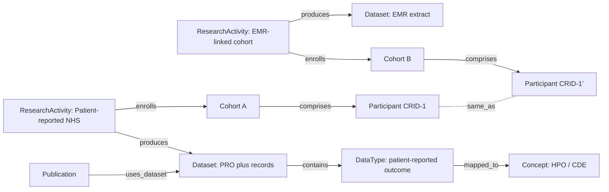

# SCN2A example

This page shows the framework instantiated for an SCN2A community. It is an **illustrative sample**: the entries are representative archetypes that demonstrate how a real data census populates the schema. It contains no participant data, no internal study names, no partner names, and no document links. The companion [Census to schema mapping](census-mapping.md) page explains how an organization's actual inventory maps in, and that real mapping is kept in an internal file rather than published here.

!!! warning "Sample values only"
    Every number and label below is illustrative. Real values, agreement links, and sharing restrictions belong in a private instantiation, not on a public site.

## Sample portfolio

A gene community typically holds a handful of complementary study types. Represented as `ResearchActivity` nodes, each producing a `Dataset` of a given `DataType`, with a cohort size, an overlap key where one exists, and governance in place:

| Study archetype | Data type | Cohort (sample) | Overlap key | Governance |
|-----------------|-----------|-----------------|-------------|------------|
| Patient-reported natural history | Patient-reported plus some records | 275 | CRID | Consent, IRB on file |
| EMR-linked cohort | Structured EMR extract | 90 | CRID | Consent, IRB on file |
| Video natural history | Video assessments | 60 | CRID | Consent, IRB on file |
| Clinician-reported registry | Clinician-entered clinical data | 120 | CRID | Consent, IRB on file |
| Qualitative interview study | Qualitative transcripts | 25 | none | Consent, IRB on file |
| Genomic and biobank | Sequencing plus biospecimens | 40 | CRID | Consent, IRB on file |
| Evidence base | Literature review | not applicable | none | Public sources |

The overlap key column is the important one. Where the same participant appears in more than one study, a shared CRID lets the framework detect it without exposing identity, exactly as described on the [Patient Overlap Layer](patient-overlap.md) page.

## Sample graph

A small slice of the portfolio, showing two studies that share participants through a common overlap key, and a publication that reuses one of the datasets:

The dotted `same_as` edge is written only by the linkage service, never by hand, and is what turns two separate cohorts into a picture of true distinct participant coverage.

## What the sample demonstrates

- **Heterogeneous data types unify.** Patient-reported, EMR, video, clinician-reported, qualitative, and genomic data all become `Dataset` nodes with typed `DataType` children that map to shared `Concept` nodes.
- **Overlap is visible but private.** A shared CRID connects participants across studies without any identifying information entering the graph.
- **Governance travels with the data.** Consent and IRB status are modeled per study, and sharing permissions live in `DataUsePermission` nodes rather than in a spreadsheet cell.
- **Publications close the loop.** Data reuse in the literature connects back to the dataset that enabled it.

To see how a real census becomes this graph, continue to [Census to schema mapping](census-mapping.md). To see current SCN2A research activity pulled live, see [Live feeds](live-feeds.md).
