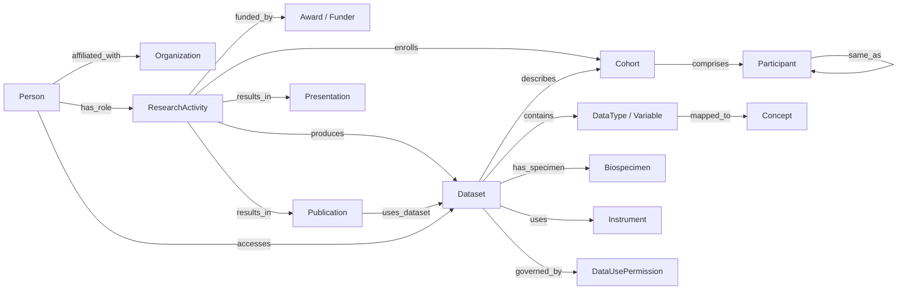

# Entity-Relationship Schema

This is the heart of the framework. Every research asset a foundation holds is one of a small number of node types, connected by a small number of edge types. The schema is deliberately compact so it can be held in one's head and instantiated in almost any store, from a curated Airtable to an RDF triplestore.

The three requirements from the original question map cleanly onto the schema:

- **Map all research activities, data types, publications, presentations, researchers, funders** becomes the node and edge inventory in [Node types](node-types.md) and [Edge types](edge-types.md).
- **Studies with potentially overlapping patients** becomes the `Participant` node keyed by a privacy-preserving global identifier, plus the `same_as` edge that federated overlap detection populates.
- **Researchers using the data** becomes the `accesses` and `uses_dataset` edges, which record both formal data-access grants and data citation in publications.

## The model at a glance

## Design principles

**Participants are never PII.** The `Participant` node carries only a study-agnostic global identifier or linkage token. Names, dates of birth, and contact details never enter the graph. Overlap is expressed as a `same_as` edge between two `Participant` nodes that resolve to the same global identifier.

**Identifiers are the primary keys.** Wherever a public persistent identifier exists (ORCID, ROR, DOI, RAiD), it is the node's key. This makes merges across sources deterministic and lets the graph self-populate.

**Concepts sit beside variables.** Every `DataType` maps to one or more controlled `Concept` nodes (an HPO term, an OMOP concept, a LOINC code, a NINDS CDE). This is what makes cross-study pooling possible rather than merely aspirational.

**Governance is a node, not a note.** Data use permissions are modeled explicitly so that access decisions are queryable and auditable.

Continue to [Node types](node-types.md) for the full definition of each entity, or jump to the [machine-readable schema](machine-readable.md) to download the model as YAML.
